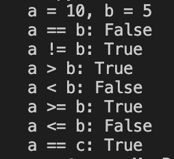

booleans.py 
Create two boolean variables: is_student and is_employed, then print them. 
Use the and operator to check if both are true and print the result. 
Use the or operator to check if at least one is true and print the result. 
Output 
True False 
False 
True 

number.py 
Create a variable age and assign it as an integer. 
Print the value of age. 
Create a variable height as a float and print it. 
Calculate age_in_days by multiplying age by 365 and print it. 
Divide age by 7, store the result in result, and print it. 
Output 
18 
1.64 
6570 
2.5714285714285716 

string.py 
Create a variable name with full name as a string and print it. 
Use string concatenation to make a greeting message and print it. 
Use an f-string to make the same greeting message and print it. 
Find the length of name using len() and print it. 
Output 
Pema Rinzin Deolkar 
Kuzuzangpo, Pema Rinzin Deolkar! 
Kuzuangpo, Pema Rinzin Deolkar! 
19 

type_conversion.py 
Convert age to a string and concatenate it with another message, then print it. 
Convert a numeric string "18" to an integer and print it. 
Try converting a non-numeric string to an integer and handle the error with a try-except block. 
Output 
I am 18 years old. 
18 
Error: invalid literal for int() with base 10: 'KUZU' 

DATA STRUCTURES 

dictionaries.py 
Create a dictionary with name, age, height, and student status, then print it. 
Add a key "favorite_color" to the dictionary and print it again. 
Try to access a non-existing key and handle the KeyError using a try-except block. 
Output 
{'name': 'Pema Rinzin Deolkar', 'age': 18, 'height': 1.64, 'is_student': True} 
{'name': 'Pema Rinzin Deolkar', 'age': 18, 'height': 1.64, 'is_student': True, 'favorite_color': 'White'} 
Error: 'weight' 

lists.py 
Create a list of favorite fruits and print it. 
Add another fruit to the list using append() and print again. 
Access the second fruit in the list by index and print it. 
Output 
['blueberry', 'peach', 'mango', 'grape'] 
['blueberry', 'peach', 'mango', 'grape', 'watermelon'] 
peach 

OPERATORS

arithematics.py 
Create two variables, a and b, and assign them 15 and 4, then print both. 
Perform the four basic arithmetic operations between a and b, and print the result of each. 
Use the modulus operator to get the remainder of a divided by b, and print it. 
Use the exponentiation operator to calculate a raised to the power of b, and print the result. 
Use floor division to divide a by b, and print the result. 
Output 
a = 15, b = 4 
Addition: 19 
Subtraction: 11 
Multiplication: 60 
Division: 3.75 
Modulus: 3 
Floor Division: 3 

assignment.py 
Create a variable x with the value 10 and print it. 
Increase x by 5 using += and print the new value. 
Decrease x by 3 using -= and print the new value. 
Multiply x by 2 using *= and print the result. 
Divide x by 4 using /=, and print the value. 
Output 
Initial x: 10 
After x += 5: 15 
After x -= 3: 12 
After x *= 2: 24 
After x /= 4: 6.0 

comparison.py 
Create two variables, a and b, with values 10 and 5, then print both. 
Use comparison operators to compare a and b, printing the result of each comparison. 
Create a variable c with value 10 and compare it to a, printing the result. 
Output 
a = 10, b = 5 
a == b: False 
a != b: True 
a > b: True 
a < b: False 
a >= b: True 
a <= b: False 
a == c: True 

logical.py 
Create two boolean variables, x and y, assign them to True and False, and print both. 
Use the and operator with x and y, and print the result. 
Use the or operator with x and y, and print the result. 
Use the not operator with both x and y, and print each result. 
Output 
x = True, y = False 
x and y: False 
x or y: True 
not x: False 
not y: True 

CONTROL STRUCTURE

break_continue.py 
Use a while loop with a break statement to print numbers starting at 0 and ending before 5, then print "Loop ended." 
Write a for loop that uses continue to skip printing even numbers from 1 to 5, printing only odd numbers. 
Write a for loop to search for a specific number in a list, print a message for each non-match, and stop the loop once found, printing a found message. 
Implement a number guessing game using a while loop; prompt the user to guess a random secret number between 1 and 10, give hints if the guess is too high or low, count attempts, and break when the guess is correct, printing the attempt count. 
Use a for-else loop inside a function to check if a number is prime; print whether the number is prime or not. 
Output 
0 
1 
2 
3 
4 
Loop ended 
1 
3 
5 
Not 8... 
Not 8... 
Not 8... 
Not 8... 
Found 8! 
Guess the number (1-10): 7 
Too high. Try again. 
Guess the number (1-10): 5 
tashi delek! You guessed it in 2 attempts. 
17 is prime. 

  

conditionals.py 
Create an if-else statement that checks if a number is positive; print "The number is positive." if true, otherwise print "The number is non-positive." 
Extend the if-else to include zero as a separate case using elif, printing whether the number is positive, negative, or zero. 
Write a program that assigns a letter grade from a numerical score using if-elif-else conditions: A for >= 90, B for >= 80, C for >= 70, D for >= 60, otherwise F; then print the grade. 
Use a ternary operator to check whether a number is even or odd and print the result. 
Implement a simple calculator using if-elif-else statements to perform addition, subtraction, multiplication, or division based on an operator variable; handle division by zero and invalid operators appropriately; print the result. 
Output 
The number is positive. 
The number is positive. 
The number is zero. 
Your grade is: A 
The number is odd. 
Result: 15 

 

loops.py 
Write a for loop to print numbers from 1 through 5. 
Use a while loop to print numbers from 5 down to 1 in reverse order. 
Write a for loop to calculate the sum of numbers from 1 to 10 and print the total. 
Use a for loop to iterate over a list of fruits and print each fruit. 
Write a nested for loop to create a multiplication table for numbers 1 to 3, printing the product for each pair. 
Output 
1 
2 
3 
4 
5 
5 
4 
3 
2 
1 
The sum of numbers from 1 to 10 is: 55 
apple 
mango 
blueberry 
1 * 1 = 1 
1 * 2 = 2 
1 * 3 = 3 
2 * 1 = 2 
2 * 2 = 4 
2 * 3 = 6 
3 * 1 = 3 
3 * 2 = 6 
3 * 3 = 9 

FUNCTION AND SCOPE

basic_function.py 
Write a function greet that prints "Kuzuzangpo la!" and call it. 
Modify greet to accept a name parameter and greet that person. 
Write a function square that returns the square of a given number. 
Create a function is_even that returns True if a number is even, False otherwise. 
Write a function print_numbers that prints numbers from 1 to n inclusive. 
Output 
Kuzuzangpo la! 
Hello, Deolkar! 
25 
True 
False 
1 
2 
3 
4 
5 

  

parameters_and_returns.py 
Write a function greet_with_default that takes a name parameter with default "Guest" and prints a greeting. 
Define a function calculate_rectangle_area that calculates and returns the area from width and height. 
Write a function print_info that accepts any number of keyword arguments and prints their keys and values. 
Create a function min_max that takes a list and returns the minimum and maximum values. 
Define a function safe_divide that returns the division of two numbers, or an error message if divisor is zero. 
Output 
Hello, Guest! 
Hello, Rinzin! 
The area of the rectangle is: 54 
name: Deolkar 
age: 18 
city: pling 
Min: 1, Max: 11 
5.0 
Cannot divide by zero 

  

recursion.py 
Write a recursive function factorial to compute the factorial of a number. 
Create a recursive function fibonacci to compute the nth Fibonacci number. 
Output 
120 
13 

  

scope.py 
Demonstrate local vs global variables by defining a global variable x, a local x in a function, and printing both. 
Modify a global variable inside a function using the global keyword; increment a counter. 
Write nested functions that demonstrate use of nonlocal keyword with variable x. 
Local x: 20 
Global x: 10 
Count: 1 
Count: 2 
Final count: 2 
Inner x: inner 
Outer x: inner 

  

FILE OPERATORS

binary_files.py 
Write a function create_binary_file that writes a series of bytes to a binary file; call with 'binary_sample.bin'. 
Define a function read_binary_file that reads and prints the contents of a binary file; call with 'binary_sample.bin'. 
Write a function append_to_binary_file that appends bytes to an existing binary file; call to append bytes to 'binary_sample.bin', then read and print the file. 
Output 
Binary file created successfully. 
Binary content: b'\x00\x01\x02\x03\x04\x05' 
Bytes appended to binary file. 

  

file_management.py 
Write a function file_exists to check if a file exists; print results for 'sample.txt' and a nonexistent file. 
Define a function rename_file to rename a file; rename 'sample.txt' to 'renamed_sample.txt' and confirm it exists. 
Write a function delete_file to delete a given file, printing confirmation or nonexistence; delete 'binary_sample.bin'. 
Create a function create_directory to create a directory if not existing; create 'new_folder'. 
Write a function list_files to list all files in a given directory; list files in the current directory. 
Define a function copy_file to copy a file from a source to a destination; copy 'renamed_sample.txt' to 'new_folder/copied_sample.txt'. 
Write a function read_csv_file to read and print contents of a CSV file; first create a sample CSV with rows for "Name, Age, City" and read it. 
Output 
'sample.txt' exists: True 
'nonexistent.txt' exists: False 
File renamed successfully. 
'renamed_sample.txt' exists: True 
binary_sample.bin has been deleted. 
Directory 'new_folder' created successfully. 
Files in the current directory: 
new_folder 
renamed_sample.txt 
.DS_Store 
Icon 
Practical_1 
README.md 
.git 
Practical_2 
Practical_5 
Practical_4 
Practical_3 
first_programme.py 
File copied from renamed_sample.txt to new_folder/copied_sample.txt 
Contents of sample.csv: 
Name, Age, City 
Pema, 18, Bumthang 
Deolkar, 18, Paro 

text_files.py 
Write a function create_and_write_file that creates a new text file and writes three lines to it; call it with 'sample.txt'. 
Write a function read_and_print_file that reads and prints the content of a text file; call it with 'sample.txt'. 
Define a function append_to_file that appends a new line to an existing file; call it to append one line to 'sample.txt', then read and print the file. 
Write a function print_lines_with_numbers that reads a file line by line, printing each line prefixed by its line number; call it with 'sample.txt'. 
Create a function count_words that counts and returns the number of words in a file; call it with 'sample.txt' and print the word count. 
Output 
File create and written successfully. 
This is the first line. 
This is the second line. 
This is the third line. 
Line appended successfully. 
This is the first line. 
This is the second line. 
This is the third line. 
This is an appended line. 
1: This is the first line. 
2: This is the second line. 
3: This is the third line. 
4: This is an appended line. 
The file contains 20 words. 

  