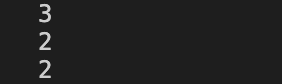
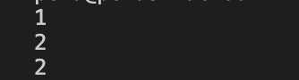

Practical 3

stack.py

Create a Stack class with methods to check if empty, push items, pop the top item, peek at the top item, and get the current size. 
Instantiate the Stack and push the integers 1, 2, and 3 onto it. 
Pop the top item; expect to get 3. 
Peek at the top item without removing it; expect to get 2. 
Check the size of the stack; expect to get 2. 

Output 
3

2

2

  

queue.py

Define a Queue class using collections.deque with methods to check if it is empty, enqueue (add) items, dequeue (remove) items from the front, peek at the front item, and get the current size. 
Create an instance of the Queue and enqueue three tasks: "Task 1", "Task 2", and "Task 3". 
Dequeue the first task; expect "Task 1" as the output. 
Peek at the front of the queue without removing it; expect "Task 2". 
Check the size of the queue; expect 2. 
Output 
1

2

2

  
