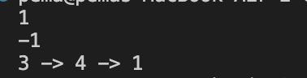
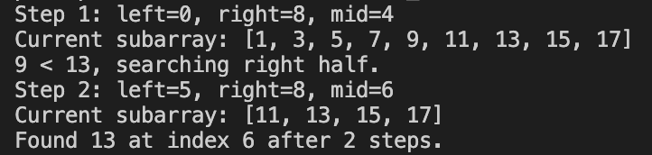
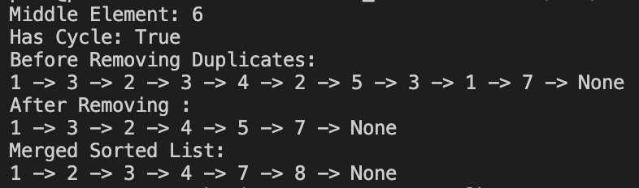

Practical 4
singly_linked_list.py 
Define a Node class with data and a pointer to the next node. 
Define a LinkedList class with methods to check if empty, insert nodes at the front or end, delete the front node, search for a value, and display all elements. 
Create a linked list instance, add nodes at the end and front. 
Display the list elements as a chain. 
Search for a value in the list, returning True or False. 
Delete the front node and display the updated list. 
Output 
1

-1

3 -> 4 -> 1

  

reverse_linked_linked.py 
First, use the ListNode class to make nodes for your singly linked list, giving each node a value and a link to the next node. 
To reverse a list, create some nodes, join them together.  
For merging, create two sorted lists using ListNode objects, link each list. 
To remove the nth node from the end, build a list with ListNode. 
You can also use the Solution class method in exactly the same way to reverse a list.  
Always create your test linked lists first, run the function, and print each value to see that your code works right. 

Binary_search_function.py 
Array must be sorted. 
Set left and right pointers (start and end of array). 
Keep repeating these steps: 
Find the middle index of the current search area. 
If the middle value equals your target, you're done—return its index. 
If the middle value is less than your target, focus only on the right half for the next round. 
If the middle value is greater than your target, focus only on the left half for the next round. 
Do this until you find the target or there’s nothing left to search. 
If target is not found, return -1. 
Output 
Step 1: left=0, right=8, mid=4

Current subarray: [1, 3, 5, 7, 9, 11, 13, 15, 17]

9 < 13, searching right half.

Step 2: left=5, right=8, mid=6

Current subarray: [11, 13, 15, 17]

Found 13 at index 6 after 2 steps.

  

further_exercises.py 
Create a linked list and add values to it. 
Use a function to find the middle element. 
Set up a linked list and check if it has a cycle.  
Build a linked list with some repeated values and remove all duplicates.  
Make two sorted linked lists and merge them into one sorted list.  
After each operation, print the linked list to see the result. 
Output 
Middle Element: 6

Has Cycle: True

Before Removing Duplicates:

1 -> 3 -> 2 -> 3 -> 4 -> 2 -> 5 -> 3 -> 1 -> 7 -> None

After Removing :

1 -> 3 -> 2 -> 4 -> 5 -> 7 -> None

Merged Sorted List:

1 -> 2 -> 3 -> 4 -> 7 -> 8 -> None

  

