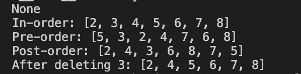
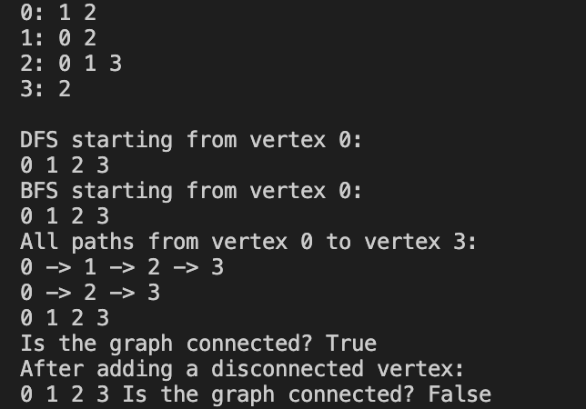

Binary_tree_search.py 
Define a binary search tree.  
Insert values.  
Search for values.  
Traverse the tree in in-order, pre-order, and post-order.  
Delete a node from the tree and show the updated in-order traversal. 
Output 
None

In-order: [2, 3, 4, 5, 6, 7, 8]

Pre-order: [5, 3, 2, 4, 7, 6, 8]

Post-order: [2, 4, 3, 6, 8, 7, 5]

After deleting 3: [2, 4, 5, 6, 7, 8]

  

graph_data_structure.py 
Create a graph. Add vertices and edges. Print the graph. 
Run depth-first search (DFS) from a start vertex and print each node as you visit it. 
Run breadth-first search (BFS) from a start vertex, printing nodes in visited order. 
Find and print all paths from one vertex to another. 
Check if the graph is connected and print the result. 
Add a new disconnected vertex, then check again and print if the graph is still connected. 
Output 
0: 1 2

1: 0 2

2: 0 1 3

3: 2

DFS starting from vertex 0:

0 1 2 3 

BFS starting from vertex 0:

0 1 2 3 

All paths from vertex 0 to vertex 3:

0 -> 1 -> 2 -> 3

0 -> 2 -> 3

0 1 2 3 

Is the graph connected? True

After adding a disconnected vertex:

0 1 2 3 Is the graph connected? False

  

