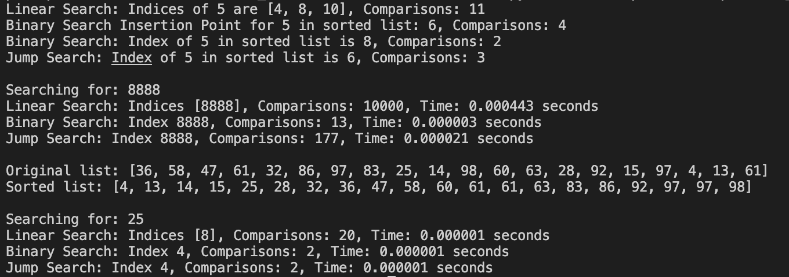

search_sort_algorithm.py 
Run linear search to get all indices and comparisons.  
Sort the list.  
Run binary search to find the index and comparisons.  
Find where target would be inserted with binary search insertion point.  
Run jump search to find the index and comparisons.  
Output 
Linear Search: Indices of 5 are [4, 8, 10], Comparisons: 11

Binary Search Insertion Point for 5 in sorted list: 6, Comparisons: 4

Binary Search: Index of 5 in sorted list is 8, Comparisons: 2

Jump Search: Index of 5 in sorted list is 6, Comparisons: 3

Searching for: 8888

Linear Search: Indices [8888], Comparisons: 10000, Time: 0.000443 seconds

Binary Search: Index 8888, Comparisons: 13, Time: 0.000003 seconds

Jump Search: Index 8888, Comparisons: 177, Time: 0.000021 seconds

Original list: [36, 58, 47, 61, 32, 86, 97, 83, 25, 14, 98, 60, 63, 28, 92, 15, 97, 4, 13, 61]

Sorted list: [4, 13, 14, 15, 25, 28, 32, 36, 47, 58, 60, 61, 61, 63, 83, 86, 92, 97, 97, 98]

Searching for: 25

Linear Search: Indices [8], Comparisons: 20, Time: 0.000001 seconds

Binary Search: Index 4, Comparisons: 2, Time: 0.000001 seconds

Jump Search: Index 4, Comparisons: 2, Time: 0.000001 seconds

  