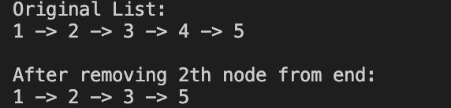
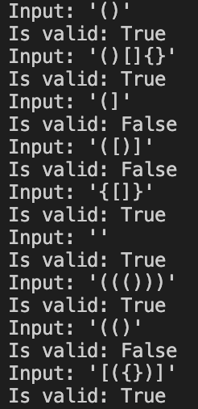

reverse_link.py  
  

duplicated.py 
  

nth_node.py 
  

sorted_list.py 
  

stack_using_queue.py 
  

stock.py 
  

substring.py 
  

three_sum.py 
  

two_sum.py 
  

valid_anagram.py 
  

valid_palindrome.py 
  

valid_parenthesis.py 
  

